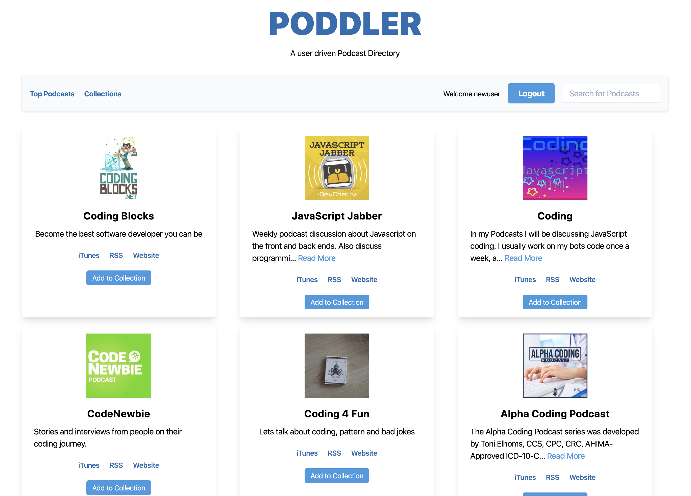

# Poddler 


## Description

Poddler is a user driven Podcast Directory. Its purpose is to aid people in the discoverability of podcasts to listen to. A user can bookmark different collections, esentially a list of podcasts. At the moment the app just lets you name a collection and rate and review a particular podcasts. The longterm vision is to create a community of avid Podcast listeners to signup. It will like [Goodreads](https://www.goodreads.com/) but for podcasts.  

## Technologies

- [Node.js](https://nodejs.org/en/) 
- [Express](https://expressjs.com/) 
- [MySQL](https://www.mysql.com/) 
- [Handlebars](http://handlebarsjs.com/) 
- [Tailwindcss](https://tailwindcss.com/)  
- [jQuery](https://jquery.com/)
- [Sequelize](https://sequelize.org/)

## Usage and Installation

Feel free to clone or fork this repo if you find it useful. To install dependencies make sure to run:

```
npm i
```

You will also need to install [MySql Workbench](https://www.mysql.com/products/workbench/) or some other application that handles SQL databases. Before spinning up the server use the schema.sql to build up the database with MySql Workbench.

If everything is ok you should be able to see this app running locally in your browser at localhost:8080. 

## Demo

Demo is still in progress...

## Contributing

If you wish to contribute to this project please do a pull request. That be super cool.

## Questions?


Have any questions? Want to collaborate on a project? Shoot me an [email](yarocruz@gmail.com)